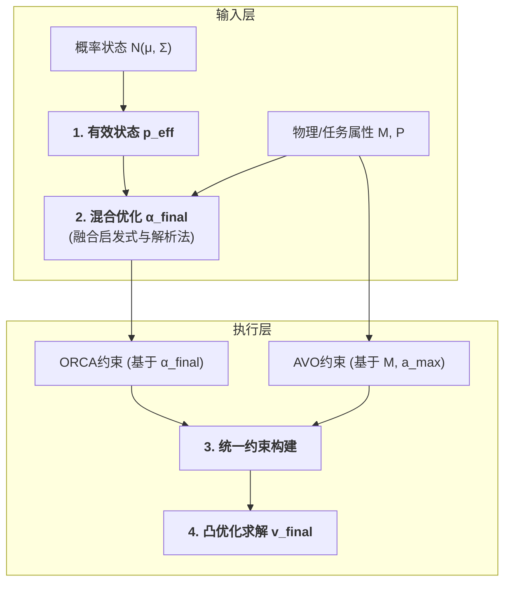
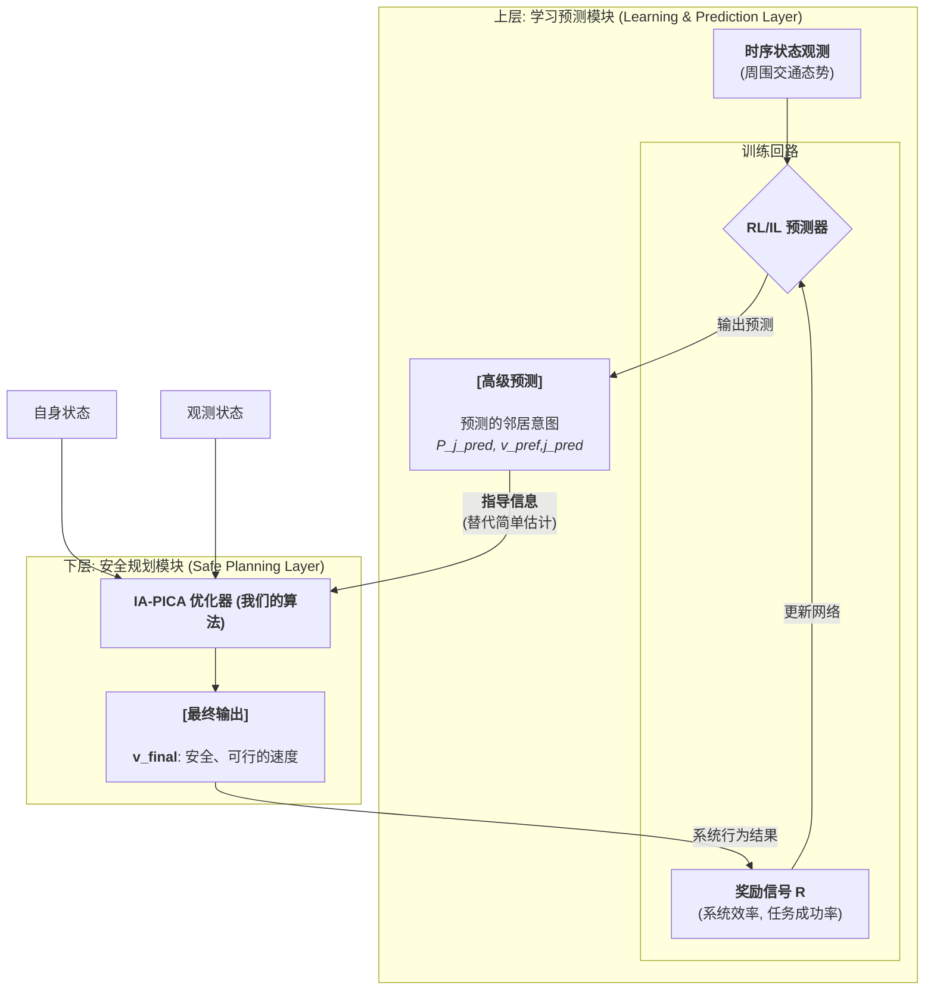

# 关于新方法model的说明

### **1. 研究动机：ORCA类算法在异构场景中的根本性局限**

ORCA原来的问题：
- 不适用非对称性的无人机集群，在无人机的避让责任分配问题上不合理
- 没有考虑运动交互过程中，因异质无人机的运动能力和策略不同，所需的运动空间规划不同
- 由于是反应式算法,在运动时感知中容错很低，容易引发碰撞

### **2. 核心思想：一个混合、分层决策框架**

我们最核心的创新就一点：我们设计了一个‘混合优化器’，来自动计算每个智能体应该承担多少规避责任（Alpha值），而这个计算是非对称的、考虑物理特性的、并且能应对不确定性的。该优化器由两个并行且互补的决策引擎构成，并由一个风险仲裁器动态协调：

##### **2.1 混合优化器 (核心创新)**

*   **A. 启发式引擎（"快脑" - Heuristic Engine）**：

    基于“环境压力越大、自身能力越强、任务越不重要，责任越大”的直觉。定义“责任分数” 
    $$S_i = (w_\rho \rho_i + w_M \text{tr}(\mathbf{M}_i^{-1})) / (w_P P_i)$$
    其中，$w_i$是各个参数的权重，$P$是无人机任务的权限，$\rho_i$是局部拥挤度的衡量，用大创原本的方案，M是原本方向矩阵W方案的改进，惯性矩阵的迹的倒数 $tr(M_i^{-1})$，用于量化机动性。$i$承担的责任为其分数占比：
    $$\alpha_{h,i} = \frac{S_i}{S_i + S_j}$$

*   **B. 解析法引擎 （"慢脑" - Analytical Engine）**
    通过最小化一个联合的**物理运动代价**函数 $C(\alpha_i)$ 来求解理论最优责任。
    1.  **代价函数**:
        $$
        C(\alpha_i) = \Sigma_{i=0}^{i=n} \rho_i ||\mathbf{v}'_i(\alpha_i) - \mathbf{v}_{\text{pref},i}||^2_{\mathbf{M}_i}
        $$
        其中 $||\mathbf{x}||^2_\mathbf{M} = \mathbf{x}^T \mathbf{M} \mathbf{x}$ 代表真实的运动学代价。

    2.  **动力学线性化**: 假设在一个小的时间步内，规避速度 $\mathbf{v}'_k$ 与其责任 $\alpha_k$ 呈线性关系：$\mathbf{v}'_k(\alpha_k) \approx \mathbf{a}_k \alpha_k + \mathbf{b}_k$。向量 $\mathbf{a}_k, \mathbf{b}_k$ 可通过对ORCA求解器进行一次数值微分高效求得。

    3.  **解析解**: 将线性模型代入代价函数，得到一个关于 $\alpha_i$ 的二次函数 $C(\alpha_i) \approx K_1 \alpha_i^2 + K_2 \alpha_i + K_3$。其最小值点可通过令导数为零求得：
        $$
        \alpha_{a,i} = -\frac{K_2}{2K_1}
        $$

*   **C. 风险加权融合 (Risk-Weighted Blending)**
    根据距离风险 + 碰撞时间风险（越短风险越高）计算的风险评分 `Risk`，通过权重 $w = f(\text{Risk})$ 对两个引擎的结果进行线性插值，得到最终的责任参数 $\alpha_{\text{final},i}$。

##### **2.2 概率与物理状态的建模**

为支撑上述优化器，我们对智能体状态进行了两层抽象：

1.  **概率状态层**：我们将每个智能体 `i` 的位置和速度建模为高斯分布 $\mathbf{p}_i \sim \mathcal{N}(\boldsymbol{\mu}_{p_i}, \mathbf{\Sigma}_{p_i})$。为了应用确定性几何，我们首先计算一个保守的**有效位置** $\mathbf{p}_{\text{eff},i}$，该位置为不确定性预留了安全边际。
   
2.  **物理语义层**：将智能体的异构性抽象为两个核心语义参数：
    *   **任务优先级 `P`**：一个标量，量化任务的重要性。
    *   **惯性矩阵 `M`**：一个矩阵，量化智能体在不同方向上改变运动状态的“难度”（e.g., 对于敏捷的四旋翼，$\mathbf{M} \approx m\mathbf{I}$；对于固定翼，惩罚侧向/垂向速度变化的非对角线项会很大）同时，以M导向引入AVO方法，既解决了在运动轨迹场景的不自然性，同时避免了在无人机集群场景下原来AVO、GRCA方法繁杂的运算和建模。

### **3. 实现框架**

决策流程是一个清晰的分层结构，如下图所示：

1.  **输入层**：感知层提供三类输入：经处理的有效状态 `p_eff`、物理/任务属性 `M, P`、环境特征 `ρ` 和实时风险 `Risk`。
2.  **协同层**：混合优化器是核心，接收所有输入，并行运行启发式与解析法引擎，并经风险加权后输出最终责任 `α_final`。
3.  **执行层**：`α_final` 用于生成代表“社会规范”的ORCA约束；`M` 用于生成代表“物理极限”的AVO约束。所有约束被送入一个统一的凸优化求解器，最终输出一个既合规又可行的最优速度 `v_final`。

1.  **有效状态生成**: 将概率状态 $N(\mu, \Sigma)$ 转化为带有安全边际的确定性状态 $\mathbf{p}_{\text{eff}}$。
2.  **混合优化**: 调用混合优化器，根据 $\mathbf{p}_{\text{eff}}$ 及物理/任务属性 `M, P` 计算出最终责任 `α_final`。
3.  **统一约束构建**:
    *   **ORCA约束**: 基于 `α_final` 生成代表“社会规范”的几何半空间。
    *   **AVO约束**: 基于 `M` 和最大加速度 `a_max` 生成代表“物理极限”的动力学半空间。
4.  **凸优化求解**: 在所有ORCA和AVO约束构成的凸可行域内，求解一个最接近目标速度 $\mathbf{v}_{\text{pref}}$ 的最终速度 $\mathbf{v}_{\text{final}}$。

---

### **4. 验证策略：基于“非对称十字路口”的场景化放大测试**

为极端化地凸显算法优势，我们需要设计一些基准测试场景。

*   **场景设置**：
    *   **横向流**：多架**低优先级（P=1）**、高敏捷的侦察无人机（`M = I`），匀速水平飞行。
    *   **纵向流**：一架**高优先级（P=100）**、低机动性的货运无人机（`M` 限制其转弯能力），匀速垂直飞行，路径必须与横向流交叉。
*   **测试目的**：此场景强制产生大量**异构、非对称**交互，能清晰测试算法是否能理解并利用这种差异，做出智能决策。

*   **预期现象与量化指标**：
    1.  **高优先级轨迹偏差**：
        *   **ORCA/AVO**：货运无人机轨迹严重偏离直线，频繁避让。
        *   **新方法**：货运无人机轨迹**近乎直线**，横向流无人机主动、提前避让。
        *   **指标**：货运无人机轨迹的均方根误差（RMSE）。
    2.  **系统总规避成本**：
        *   **定义**：所有无人机速度偏离其理想速度的平方和 `Σ ||v_i - v_pref,i||²`。
        *   **预期**：新方法的成本**最低**。因为它让规避成本低（更敏捷）的无人机承担更多责任，实现了全局最优。
        *   **指标**：总成本值。
    3.  **通行效率**：
        *   **预期**：在新方法管理下，整个交叉口的通行更有序，吞吐量更高。
        *   **指标**：所有无人机通过交叉口的平均时间。

该实验设计简洁、目标明确，能像放大镜一样，将不同算法的核心差异转化为可量化的性能指标，形成对比。
   
$$
\alpha_{h,i} = \text{clip}(k_\rho \cdot \rho_i, 0, \alpha_{\text{max {h}}})C(\alpha_i) \approx \rho_i ||\mathbf{v}'i(\alpha_i) - \mathbf{v}{\text{pref},i}||^2_{\mathbf{M}_i} + w_p (P_j^{\text{est}} - P_i) \alpha_i
$$

### **5. 后续思考**

