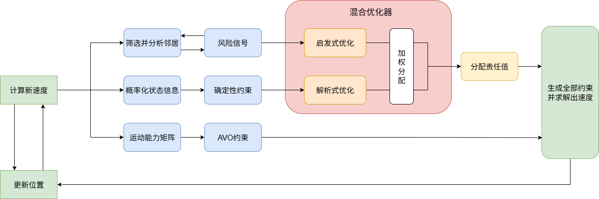
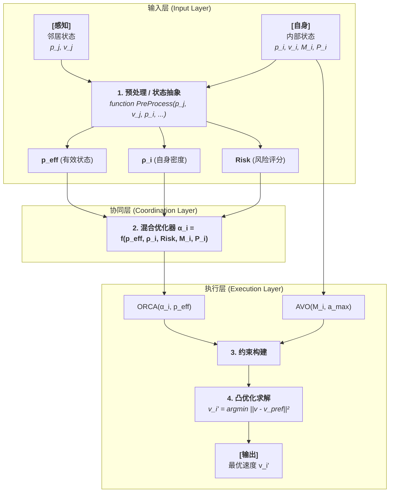

# 关于新方法model的说明


#### **1. 研究动机：ORCA类算法在异构场景中的根本性局限**

ORCA及其变体是建立在**对称性**和**物理理想化**假设之上的。当应用于未来的异构无人机集群时，这些假设导致了三个根本性局限：
- 不适用非对称性的无人机集群，在无人机的避让责任分配问题上不合理
- 没有考虑运动交互过程中，因异质无人机的运动能力和策略不同，所需的运动空间规划不同
- 由于是反应式算法，在运动时感知中容错很低，容易引发碰撞; 若ORCA用约束代替非凸计算，带来的是过于保守

---

#### **2. 核心思想：一个混合、分层的决策框架**

为解决上述问题，我们设计的核心是一个**混合优化器**，它将复杂的异构协同问题解耦为两个层面：
1.  **社会协同层面**: 解决“谁该让谁？”的**责任分配**问题。
2.  **物理执行层面**: 解决“如何让？”的**运动执行**问题。



##### **2.1 混合优化器：非对称责任的智能求解**

**1. 快慢脑优化器必要性说明**

异质无人机集群的避障核心是责任分配问题。传统均等分配策略在多样性（尺寸、任务、机动性）面前失效，亟需智能决策机制，这正是“慢脑”存在的必要性。

“慢脑”是一个分布式优化器，它通过数学建模，将避障转化为最小化系统总代价的命题。它量化权衡三大关键因素：机动代价（通过惯性矩阵，让笨重无人机少机动）、任务代价（赋予高优先级无人机通行权）和拥堵代价（鼓励密集区无人机多担责）。

面对长航时巡检机与紧急运输机相遇的冲突，慢脑能计算出能耗与时间损失的最优平衡点。在可能引发集体僵局的瓶颈处，慢脑能超越个体利益，指挥关键无人机做出“利他”机动以解锁全局流量。对于人控无人机等异常干扰，慢脑能脱离固定规则，进行一次性最优决策，提供终极鲁棒性。

最后，二者的精髓在于协同配合。快脑与慢脑在决策流程的终点进行深度融合。快脑基于直观规则快速生成一系列基础规避约束，慢脑则针对关键交互进行深度优化，计算出精细的责任分配参数，并转化为相应的最优约束。这种“分治-融合-投影”的策略，平衡了计算复杂度与决策质量，使算法既能应对复杂场景，又能满足无人机的实时计算要求。

**2. 核心机制**

为解决上述矛盾，我们采用了一种**基于多维触发器的级联决策机制**,此级联结构实现了计算效率与决策精度的最优权衡，是解决反应式协同规划深层矛盾的有效架构。。
该机制默认依赖一个高效的**启发式规则库（“快脑”）** 处理大多数常规交互，保证实时性。仅当满足特定条件时，才激活计算昂贵的**数值优化器（“慢脑”）**进行精确求解。触发条件包括：
    1. **高协同潜力**：智能体间异构性指数超过阈值，存在显著的非对称收益空间。
    2. **高决策风险**：碰撞时间极短或距离极近，对决策精度极为敏感。
    3. **高环境约束**：智能体处于拥挤或狭窄环境，其可行运动空间已受严重压缩。


*   **为什么混合优化器能处理非对称性？**
    因为它的两个决策引擎都**内建了对非对称信息的处理能力**。对称性算法（如ORCA）的输入只有几何信息（相对位置、速度），而我们的优化器额外输入了能够**打破对称性**的物理和任务信息（`M`, `P`），并将其转化为非对称的输出`α`。

    ```mermaid
    graph TD
        subgraph "混合优化器内部流程"
            %% 输入
            In["<b>输入</b>"];

            %% 引擎
            subgraph "A. 启发式引擎"
                H["<i>基于规则的快速解</i>"];
            end

            subgraph "B. 解析法引擎-频率更新"
                A["<i>基于优化的最优解</i>"];
            end

            %% 融合
            subgraph "C. 风险加权融合"
                R["<i>风险驱动的动态融合</i><br>"];
            end

            %% 输出
            Out["<b>输出责任分配结果</b>"];

            %% 流程
            In --> H;
            In --> A;
            In -- "Risk" --> R;
            H -- "α_h" --> R;
            A -- "α_a" --> R;
            R --> Out;
        end
    ```

    *   **启发式引擎 (“快脑”)**:
        它通过一个基于直觉规则的“责任分数”函数 $S_i$ 来打破对称性。
        $$
        S_i = w_m \text{tr}(\mathbf{M}_i^{-1}) + w_\rho \rho_i + w_P \frac{1}{P_i}
        $$
        *   **数学逻辑**: 此函数将异构性量化。**机动性越强**（惯性矩阵的迹的倒数 $\text{tr}(\mathbf{M}_i^{-1})$ 越大）、**环境越拥挤**（局部密度 $\rho_i$ 越大）、**任务优先级越低**（$P_i$ 越小），则责任分数 $S_i$ 越高。最终的责任分配与分数成正比：
        $$
        \alpha_{h,i} = \frac{S_i}{S_i + S_j}
        $$
        *   **惯性矩阵说明**：惯性矩阵是基于agent运动能力上的建模，矩阵对角线上的值分别对应在xyz轴上的运动能力，其他位置的值则对应旋转等能力，一般来说，我们只需改动xyz轴上的运动能力即可。
        $$
        M = 
        \begin{bmatrix}
        p_x & 0 & 0 \\
        0 & p_y & 0 \\
        0 & 0 & p_z
        \end{bmatrix}
        $$

    *   **解析法引擎 (“慢脑”)**:
        它通过最小化一个联合的物理运动代价函数 $C(\alpha_i)$ 来寻找最优的非对称解。
        1.  **代价函数**: 描述了整个交互对 `(i, j)` 为规避付出的总运动学代价。
            $$
            C(\alpha_i) = \underbrace{\rho_i ||\mathbf{v}'_i(\alpha_i) - \mathbf{v}_{\text{pref},i}||^2_{\mathbf{M}_i}}_{\text{Cost for agent i}} + \underbrace{\rho_j ||\mathbf{v}'_j(1-\alpha_i) - \mathbf{v}_{\text{pref},j}||^2_{\mathbf{M}_j}}_{\text{Cost for agent j}}
            $$

            $$
            \min_{\alpha_i} C(\alpha_i) = \sum_{k \in {i, j}} \text{Cost}_k(\alpha_k)
            $$
            *   **数学逻辑**: 这里的非对称性由 $\mathbf{M}_i \neq \mathbf{M}_j$ 和 $\mathbf{v}_{\text{pref},i} \neq \mathbf{v}_{\text{pref},j}$ 引入。如果一方的惯性矩阵`M`很大（笨重），那么任何速度偏离都会导致巨大的代价，优化器为了最小化总代价，会自然地将责任（即产生速度偏离的`α`）更多地分配给`M`较小的那一方。

        2.  **求解过程**: 通过**动力学线性化** `v'(α) ≈ aα + b`，我们将复杂的非线性优化问题转化为一个简单的二次函数求解：$C(\alpha_i) \approx K_1 \alpha_i^2 + K_2 \alpha_i + K_3$。其最优解为：
            $$
            \alpha_{a,i} = -\frac{K_2}{2K_1}
            $$
            这个解是在考虑了双方物理差异后的理论最优非对称责任。

    *   **风险加权融合**: 最终，通过风险评分 `Risk` 对两个引擎的结果进行加权，实现了在不同交互情境下，从稳定到最优的平滑过渡。

##### **2.2 状态建模：为优化器提供语义输入**

1.  **概率状态层**：我们将每个智能体 `i` 的位置和速度建模为高斯分布 $\mathbf{p}_i \sim \mathcal{N}(\boldsymbol{\mu}_{p_i}, \mathbf{\Sigma}_{p_i})$。为了应用确定性几何，我们首先计算一个保守的**有效位置** $\mathbf{p}_{\text{eff},i}$，该位置为不确定性预留了安全边际。
   
2.  **物理语义层**：将智能体的异构性抽象为两个核心语义参数：
    *   **任务优先级 `P`**：一个标量，量化任务的重要性。
    *   **惯性矩阵 `M`**：一个矩阵，量化智能体在不同方向上改变运动状态的“难度”（e.g., 对于敏捷的四旋翼，$\mathbf{M} \approx m\mathbf{I}$；对于固定翼，惩罚侧向/垂向速度变化的非对角线项会很大）同时，以M导向引入AVO方法，既解决了在运动轨迹场景的不自然性，同时避免了在无人机集群场景下原来AVO、GRCA方法繁杂的运算和建模。

---

### **3. 实现框架与变量流程**

决策流程是一个清晰的三层结构，核心变量在各层之间传递与处理。



**变量处理流程:**

1.  **输入与预处理**:
    *   **输入**: 算法接收**自身内部状态** (`p_i, v_i, M_i, P_i`) 和可观测的**邻居外部状态** (`p_j, v_j`)。
    *   **处理**: 在预处理阶段，这些原始输入被加工成更高层次的语义信息：
        *   `p_i, v_i, p_j, v_j` -> 计算出用于几何判断的 **`p_eff`** (有效状态)。
        *   `p_eff` -> 计算出 **`ρ_i`** (局部密度) 和 **`Risk`** (风险)。

2.  **协同决策**:
    *   **输入**: 预处理后的信息 (`p_eff, ρ_i, Risk`) 和自身属性 (`M_i, P_i`) 被送入**混合优化器**。
    *   **处理**: 优化器内部通过启发式和解析法并行计算，并由`Risk`加权，最终输出一个标量——**责任参数 `α_i`**。

3.  **约束求解**:
    *   **输入**: 协同层输出的 `α_i` 和自身的物理属性 `M_i, a_max`。
    *   **处理**:
        *   `α_i` 和 `p_eff` 被用于构建代表“社会规范”的 **ORCA约束**。
        *   `M_i` 和 `a_max` 被用于构建代表“物理极限”的 **AVO约束**。
        *   所有约束共同定义了一个**凸可行速度域**。
    *   **输出**: 在该可行域内，求解器找到一个离 `v_pref` 最近的最优速度 `v_final` 作为最终输出。

---

### **4. 验证策略：基于球形异质场景测试(Validation)**

为极端化地凸显算法在密集、异构集群环境中的调度优势，我们设计了以下基准测试场景。该场景模拟了在有限三维空域内的高强度运行冲突。

*   **场景设置**：
    *   **集群A（高优先级椭球体）**：多个**高优先级（P=100）**、低机动性的大型智能体（`M` 限制其敏捷度），其运动模式为保守、稳定的穿透性机动（如模拟穿越狭窄空间）。
    *   **集群B（低优先级球体）**：多个**低优先级（P=1）**、高敏捷性的智能体（`M = I`），其运动模式为快速、探索性的随机游走，其预定路径与集群A的空域存在大量交叉。
*   **测试目的**：此场景在**高度受限的三维空域**内强制产生密集的、具有严格方向性的运动冲突，能极端测试算法在**优先级调度**和**动态冲突消解**方面的综合能力。

*   **预期现象与量化指标**：
    1.  **高优先级任务完整性**：
        *   **基准方法**：集群A的智能体轨迹频繁受到干扰，出现剧烈震荡或路径阻塞，无法保持稳定航迹。
        *   **新方法**：集群A获得**空域优先权**，其运动轨迹平滑且稳定，接近理想路径。
        *   **指标**：集群A运动轨迹的均方根误差（RMSE）与最大横向偏差。
    2.  **空间吞吐效率**：
        *   **预期**：在新方法的智能调度下，三维空域的资源利用率最大化，避免了“拥堵”和“锁死”。
        *   **指标**：单位时间内成功抵达目标的智能体数量。

---

#### **性能对比表与分析**

1. **同质化场景下运行指标展示（无权限）**
    | 指标 | 球形场景-new | 球形场景-ORCA | 椭球体场景-new | 椭球体场景-ORCA | 好坏方向 |
    |------|---------------|---------------|----------------|-----------------|--|
    | **总运行时间（时间步）** | 951 | 1219 | 1667 | >3000 |↓|
    | **安全性能** | | | | | |
    | - 总碰撞次数 | 0 | 5 | 31 | 56 |↓|
    | - 最长连续碰撞（时间步） | 0 | 6 | 52 | 21 |↓|
    | **运动效率** | | | | | |
    | - 平均运动时间（时间步） | 603.90 | 826.60 | 957.63 | 1810.07 | ↑ |
    | - 轨迹平滑度 | 10.8888 | 7.0842 | 11.7986 | 6.4404 | ↓ |
    | - 路径优化率 | 2.4349 | 3.3357 | 5.2603 | 9.8157 | ↑ |
    | **空间行为** | | | | | |
    | - 平均邻近距离 | 7.5797 | 7.7852 | 5.5390 | 4.9070 | ↑ |
    | - 空间分布均匀性 | 1.6031 | 1.4957 | 1.9883 | 2.3855 | ↓ |

    **简要分析：** 新算法在两种三维场景的**效率和安全性上均全面优于ORCA**。椭球体场景因其复杂的空间几何关系，对所有算法都更具挑战，但新算法仍能有效完成调度（1667步），而ORCA则完全失效（>3000步）。新算法仅在**轨迹平滑度**上稍逊于ORCA，这是在追求更高效率过程中做出的合理权衡。

2. **非对称场景下运行指标展示**
    异质场景中，引入了具有不同优先级和运动能力的智能体（椭球体 vs. 球体），以测试新算法的非对称避让策略。

    | 指标 | 3d环场景-new | 3d环场景-orca |
    |------|---------------|----------------|
    | **总运行时间（时间步）** | 3000 | 3000 |
    | **安全性能** | | |
    | - 总碰撞次数 | 39 | 70 |
    | - 最长连续碰撞（时间步） | 40 | 77 |
    | **运动效率** | | |
    | - 平均运动时间（时间步） | 1641.00 | 2125.15 |
    | - 轨迹平滑度 | 7.8702 | 5.2368 |
    | - 路径优化率 | 8.4651 | 11.3055 |
    | **空间行为** | | |
    | - 平均邻近距离 | 5.5483 | 5.1959 |
    | - 空间分布均匀性 | 1.1205 | 1.1204 |

    **简要分析：** 在**球形异质场景**中，新算法的性能达到最佳（852步，零碰撞），证明其**非对称避让策略在三维空间中极其有效**。而在最复杂的**椭球体异质场景**中，虽然完成了任务，但出现了较多碰撞，这揭示了算法在**极端复杂的三维空间几何冲突**中仍是下一步需要优化的重点。总体而言，新算法成功验证了其在三维异构集群中的核心优势。


