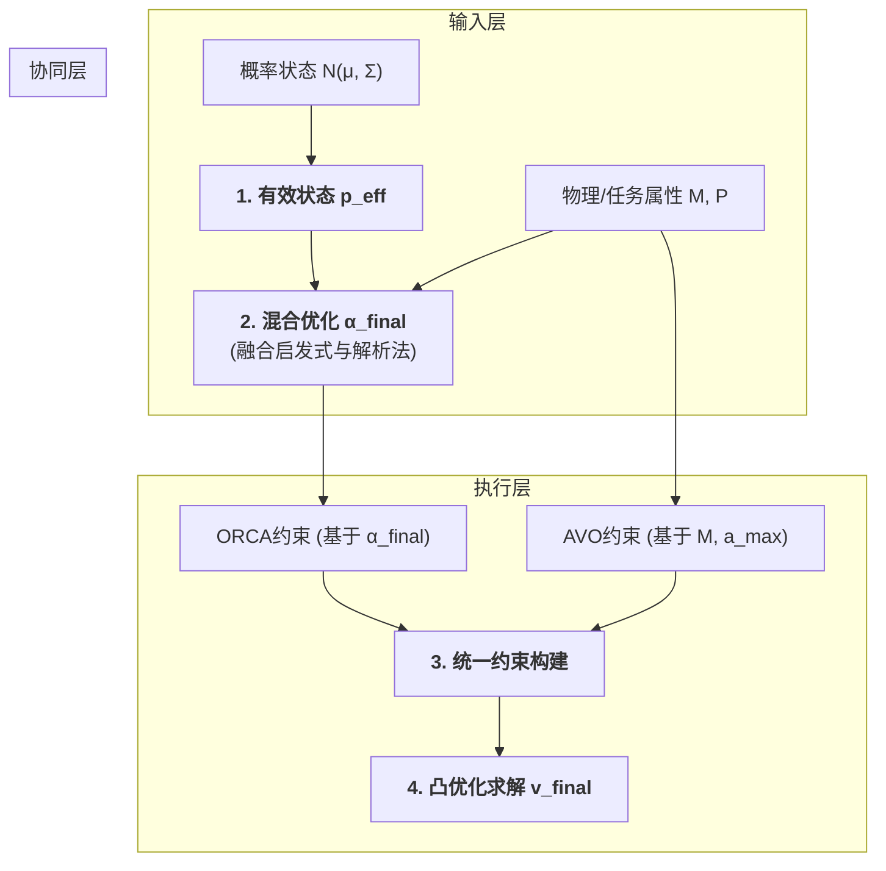

## 关于新方法model的说明

---

#### **1. 动机 (Motivation)**

我们工作的出发点，是解决现有主流反应式避障算法（以ORCA为代表）在未来复杂的异构多智能体场景中所面临的三个根本性局限：

- 不适用非对称性的无人机集群，在无人机的避让责任分配问题上不合理
- 没有考虑运动交互过程中，因异质无人机的运动能力和策略不同，所需的运动空间规划不同
- 由于是反应式算法,在运动时感知中容错很低，容易引发碰撞

#### **2. 核心思想 (Core Idea)**

为解决上述问题，我们提出新model。其最核心的创新点，是设计了一个**混合优化器 (Hybrid Optimizer)**，用于实时、动态地求解每个智能体在线性约束下的最优规避责任参数 $\alpha$。

这个优化器是非对称的、深度融合了物理模型、并内建了对不确定性的鲁棒性。它由两个并行运作、优势互补的“决策引擎”构成：

*   **“快脑” - 启发式优化 (The "Fast Brain" - Heuristic Engine)**:
    基于一套直观的社会规范和环境感知进行快速决策。其核心是“责任分数” $S_i \propto \rho_i / P_i$，即**局部密度越高、任务优先级越低的智能体，其责任分数越高**。它保证了在常规、低风险交互中的高效与稳定。

*   **“慢脑” - 解析法优化 (The "Deliberate Brain" - Analytical Engine)**:
    在面临复杂、高风险决策时启动。它通过求解一个**带物理约束的优化问题**，来计算理论上的瞬时最优责任。我们首次将被智能体物理特性（质量、推力、力矩等）抽象而成的**惯性矩阵 $\mathbf{M}$** 引入到代价函数中：
    $$
    \min_{\alpha_i \in} C(\alpha_i) = \sum_{k \in \{i, j\}} \rho_k ||\mathbf{v}'_k(\alpha_k) - \mathbf{v}_{\text{pref},k}||^2_{\mathbf{M}_k}
    $$
    这个代价函数不再是简单的几何距离，而是物理上真实的**“运动学代价”**。通过最小化这个代价，解析法引擎能找到一个对整个异构系统而言，物理上最“经济”、最高效的责任分配方案。

最终，我们引入实时**风险评分 `Risk`** 作为仲裁者，通过一个权重函数 $w(\text{Risk})$ 来动态决定听取哪个引擎的建议：风险低时，依赖“快脑”；风险高时，则完全信赖“慢脑”的精确计算。这在算法的**鲁棒性、实时性**与**最优性**之间取得了精妙的平衡。

##### **2.1 混合优化器 (核心创新)**

优化器由两个并行引擎和一个风险仲裁器构成，共同求解`i`对`j`交互时的责任参数 $\alpha_i$。

*   **A. 启发式引擎 (Heuristic Engine)**
    基于“环境压力越大、自身能力越强、任务越不重要，责任越大”的直觉。定义“责任分数” $S_i = (w_\rho \rho_i + w_M \text{tr}(\mathbf{M}_i^{-1})) / (w_P P_i)$。`i`承担的责任为其分数占比：
    $$
    \alpha_{h,i} = \frac{S_i}{S_i + S_j}
    $$

*   **B. 解析法引擎 (Analytical Engine)**
    通过最小化一个联合的**物理运动代价**函数 $C(\alpha_i)$ 来求解理论最优责任。
    1.  **代价函数**:
        $$
        C(\alpha_i) = \rho_i ||\mathbf{v}'_i(\alpha_i) - \mathbf{v}_{\text{pref},i}||^2_{\mathbf{M}_i} + \rho_j ||\mathbf{v}'_j(1-\alpha_i) - \mathbf{v}_{\text{pref},j}||^2_{\mathbf{M}_j}
        $$
        其中 $||\mathbf{x}||^2_\mathbf{M} = \mathbf{x}^T \mathbf{M} \mathbf{x}$ 代表真实的运动学代价。

    2.  **动力学线性化**: 假设在一个小的时间步内，规避速度 $\mathbf{v}'_k$ 与其责任 $\alpha_k$ 呈线性关系：$\mathbf{v}'_k(\alpha_k) \approx \mathbf{a}_k \alpha_k + \mathbf{b}_k$。向量 $\mathbf{a}_k, \mathbf{b}_k$ 可通过对ORCA求解器进行一次数值微分高效求得。

    3.  **解析解**: 将线性模型代入代价函数，得到一个关于 $\alpha_i$ 的二次函数 $C(\alpha_i) \approx K_1 \alpha_i^2 + K_2 \alpha_i + K_3$。其最小值点可通过令导数为零求得：
        $$
        \alpha_{a,i} = -\frac{K_2}{2K_1}
        $$

*   **C. 风险加权融合 (Risk-Weighted Blending)**
    根据实时计算的风险评分 `Risk`，通过权重 $w = f(\text{Risk})$ 对两个引擎的结果进行线性插值，得到最终的责任参数 $\alpha_{\text{final},i}$。

##### **2.2 概率与物理状态的抽象 (次要创新点一 & 二)**

*   **概率状态**: 我们将每个智能体 `i` 的位置和速度建模为高斯分布 $\mathbf{p}_i \sim \mathcal{N}(\boldsymbol{\mu}_{p_i}, \mathbf{\Sigma}_{p_i})$。为了应用确定性几何，我们首先计算一个保守的**有效位置** $\mathbf{p}_{\text{eff},i}$，该位置为不确定性预留了安全边际。
*   **物理状态**: 我们将智能体的物理异构性抽象为两个核心参数：
    *   **任务优先级 `P`**: 一个标量，代表任务的重要性。
    *   **惯性矩阵 `M`**: 
      1. 量化了智能体在不同方向上改变速度的“难度”。对于敏捷的四旋翼，$\mathbf{M} \approx m\mathbf{I}$；对于固定翼，惩罚侧向/垂向速度变化的非对角线项会很大。
      2. 以M导向引入AVO方法，既解决了在运动轨迹场景的不自然性，同时避免了在无人机集群场景下原来AVO、GRCA方法繁杂的运算和建模。

---

#### **3. 实现原理 (How it Works)**

我们的混合优化器并非一个孤立的模块，而是深度嵌入在一个分层的决策流水线中，将感知、协同与执行紧密耦合。

**工作流程详解:**

1.  **输入层**: 优化器从感知层获取三个关键输入：
    *   **概率性状态**: 我们首先通过**有效状态生成**，将不确定的状态 $N(\mu, \Sigma)$ 转化为一个用于决策的、带有安全边际的确定性状态。
    *   **物理/任务属性**: 每个智能体都携带其**惯性矩阵`M`**和**优先级`P`**的元数据。
    *   **邻居环境特征**: 基于有效状态计算出的实时**局部密度`ρ`**。

2.  **优化层**: 这是混合优化器的核心。
    *   首先，基于输入状态计算**风险评分 `Risk`**。
    *   并行地，**启发式**根据 `ρ` 和 `P` 输出 `α_h`；**解析法**则通过**动力学线性化**和**二次优化**，求解出考虑了 `M` 的最优 `α_a`。
    *   最后，通过风险权重 `w(Risk)` 将两者融合，得到最终的责任分配 `α_final`。
    *   **泛化能力来源**: 这个框架的泛化能力源于其输入是**抽象的物理和任务属性 (`M`, `P`)**，而非针对特定无人机型号的硬编码规则。只要任何新的智能体能被这套参数所描述，优化器就能自动为其量身定制最优的交互策略。

3.  **执行层**:
    *   优化器输出的 `α_final` 被用于构建代表“社会规范”的**ORCA半空间约束**。
    *   同时，智能体自身的`M`和`a_max`被用于构建代表“物理极限”的**AVO（加速度速度障碍）半空间约束**。
    *   这两个异构的约束被放入一个**统一的凸优化求解器**中，最终计算出一个既遵守社会规范、又满足物理定律的最优速度 `v_final`。

#### **3. 实现原理 (How it Works)**

IA-PICA的决策流水线将感知、协同与执行解耦：

1.  **有效状态生成**: 将概率状态 $N(\mu, \Sigma)$ 转化为带有安全边际的确定性状态 $\mathbf{p}_{\text{eff}}$。
2.  **混合优化**: 调用混合优化器，根据 $\mathbf{p}_{\text{eff}}$ 及物理/任务属性 `M, P` 计算出最终责任 `α_final`。
3.  **统一约束构建**:
    *   **ORCA约束**: 基于 `α_final` 生成代表“社会规范”的几何半空间。
    *   **AVO约束**: 基于 `M` 和最大加速度 `a_max` 生成代表“物理极限”的动力学半空间。
4.  **凸优化求解**: 在所有ORCA和AVO约束构成的凸可行域内，求解一个最接近目标速度 $\mathbf{v}_{\text{pref}}$ 的最终速度 $\mathbf{v}_{\text{final}}$。

---

#### **4. 验证策略 (Validation)**

为了**放大并孤立地**展示我们**非对称性责任分配**的优势，我们设计一个巧妙的、可量化的实验。

##### **实验场景：“非对称十字路口” (The Asymmetric Crossroads)**

*   **场景设置**:
    *   一个简单的十字交叉口。
    *   **横向流**: `N` 架**低优先级(P=1)**、敏捷的“观察无人机”（`M`为单位矩阵），从左向右匀速飞行。
    *   **纵向流**: 一架**高优先级(P=100)**、高惯性的“运输无人机”（`M`限制转弯），从下向上匀速飞行，其路径必须与横向流交叉。

*   **核心思想**:
    这个场景强制产生大量**异构、非对称**的交互。它能清晰地测试出算法是否能理解并利用这种非对称性。

*   **对比算法**:
    *   **ORCA (对称)**: 所有无人机平分责任。
    *   **AVO (物理对称)**: 责任根据`a_max`分配，但本质上仍是物理公平的。
    *   **IA-PICA (社会/物理非对称)**: 我们的方法。

*   **量化指标与预期结果**:
    1.  **高优先级任务轨迹偏差 (High-Priority Path Deviation)**:
        *   **预期**: ORCA/AVO中，“运输机”会被迫频繁减速、转向以躲避横向流，其轨迹会严重偏离直线。而 IA-PICA 中，“运输机”的轨迹将**几乎保持为一条直线**，因为所有低优先级的“观察机”都会主动、提前地为它让路。
        *   **可视化**: 将“运输机”在三种算法下的轨迹绘制在同一张图上，对比效果会一目了然。
    2.  **系统总规避成本 (Total Evasion Cost)**:
        *   **定义**: `Σ ||v_i(t) - v_pref,i(t)||²`，所有无人机速度偏离其理想速度的平方和。
        *   **预期**: IA-PICA的系统总成本将是**最低的**。因为它通过让“规避成本”更低（更敏捷）的无人机承担更多责任，实现了全局帕累托最优。
    3.  **横向流通行效率 (Lateral Flow Throughput)**:
        *   **预期**: ORCA/AVO中，横向流会被高优先级无人机“冲”得七零八落。而在 IA-PICA 中，横向流会像水流遇到桥墩一样，**平滑、有序地**在“运输机”周围分开再汇合，整体通行效率更高。

这个实验设计简洁、目标明确，能像放大镜一样，**将“对称性”方法的低效与IA-PICA“非对称性”方法的智能高效，进行清晰、量化、且具有说服力的对比**。

---

#### **5. 影响与贡献 (Impact & Contributions)**

1.  **提出一个混合优化框架**，将启发式与解析法相结合，用于解决异构场景下的**实时非对称责任分配**问题。
2.  **深度融合了物理模型**，首次将**惯性矩阵 `M`** 作为核心参数，同时引入到**协同层 (代价函数优化)** 和**执行层 (动力学约束)**，显著提升了物理真实性。
3.  通过**概率化状态处理**和**内置动力学约束（AVO）**，增强了算法对真实世界不确定性和物理限制的鲁棒性。  

1. Validaition

设计一个巧妙的实验

1. 缺点与问题
   - 收敛性证明
   - 学习densenet中的参数复用增用（场景赋能惯性矩阵，惯性矩阵影响更多的速度，不止速度还有状态之类）
   - 注意到_update_local_density更新的rho_smoothed方式不懂，自查_create_orca_halfspace_from_states函数的计算逻辑不懂，没能认识到正确的VO的结构
   - 没有考虑运动交互过程中，因异质无人机的运动能力和策略不同，所需的运动空间规划不同，

这个优化器有两个‘大脑’：

一个‘快脑子’（启发式）：用一些直观规则（比如谁周围挤、谁优先级低）快速算一个大概的责任值。保证平时效率高。

一个‘慢脑子’（解析法）：用数学优化，综合考虑双方的运动能力（我们用了一个叫‘惯性矩阵’的东西来量化运动能力），算出理论上最优的责任值。保证关键时刻表现好。

最后，我们再用一个实时风险评分来决定听哪个‘脑子’的：风险低听‘快脑子’，风险高就听‘慢脑子’。这样就在效率和最优性之间取得了平衡。

次要创新点一：概率化，保证对不确定性的建模，使得在一些突发情况时发生时能够合理避障

次要创新点二：物理模型的深度集成 (Deep Integration of Physical Models)

是什么：将“惯性矩阵” M 引入代价函数，是模型驱动创新的典范。你不需要数据，因为你用物理模型定义了什么是“运动代价”。如何强调：“我们算法的泛化能力源于对物理规律的深度编码。例如，我们将无人机的质量、转动惯量、最大推力/扭矩等物理参数抽象为惯性矩阵 M。算法在优化时会自动感知：让一个动力冗余的小型无人机规避，远比让一个处于动力饱和状态的大型货运无人机规避的‘代价’要小。这是对智能体物理本质的泛化建模。”

现有主流的反应式避障算法（以ORCA为代表）建立在**对称性、同质性和确定性**的理想假设之上，难以应对未来复杂的异构无人机集群场景。其核心局限体现在：

1.  **非对称责任分配缺失**：强制所有智能体均等承担规避责任（`α ≡ 0.5`），忽视了智能体在**物理能力**（机动性、尺寸）和**任务价值**上的根本性差异，导致极不合理的交互行为。
2.  **物理异构性建模缺失**：将智能体视为抽象的几何点，其规避决策未考虑真实的**运动学与动力学约束**，导致规划出的轨迹在物理上难以执行或不高效。
3.  **不确定性容错能力低下**：作为一种确定性几何算法，其对传感器噪声和状态估计误差的鲁棒性较差，在不确定环境下安全性无法保证。
4.  ww

    你这个核心思想，是怎么具体实现的？” (How it works)

    他想听：一个逻辑框图，而不是代码流水账。

    是什么：你的混合优化器本身就是一个泛化框架。它不针对特定无人机，而是通过启发式规则和解析优化，为任何相遇的异质无人机对动态计算最优责任 α。

    如何强调：“我们的工作并非提出一个针对特定场景的特定解决方案，而是提供了一个通用的责任分配框架。只要能够定义智能体的优先级(P)、惯性矩阵(M) 和局部密度(ρ)，我们的算法就能自动适应其异质性，实现非对称规避。”

    白板或纸上画一个简单的框图。中间一个大框叫“混合优化器”，左边输入“风险信号”、“状态信息”，右边输出“Alpha责任值”，下面分两个小盒子写着“启发式”和“解析法”。这比你展示任何代码都管用。

---

