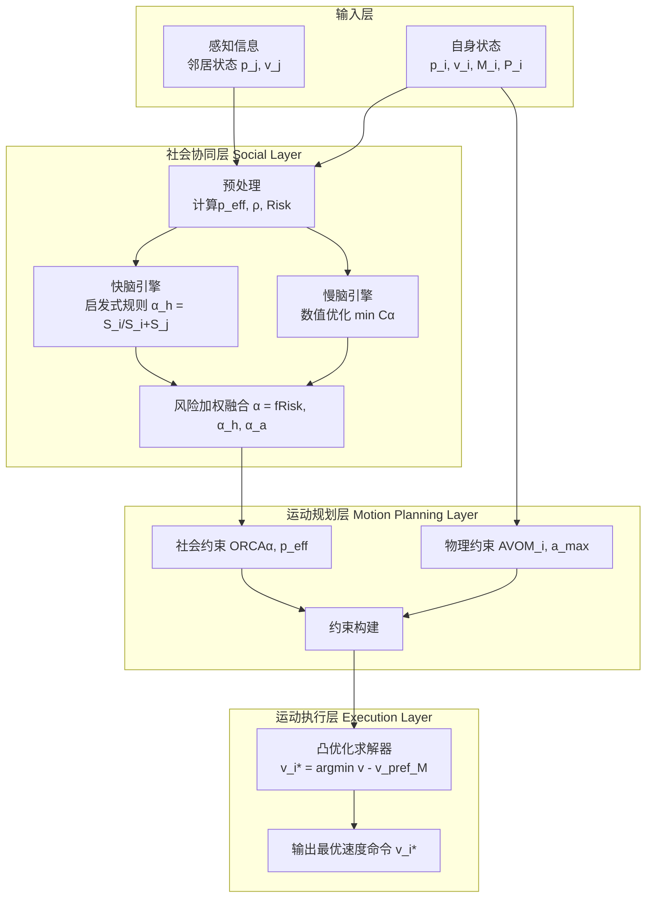

# 关于新方法model的说明

### **1. 研究动机**

在实现异质agent过程中，在运行场景中，往往会出现**密度从稀疏到稠密的分布，速度的位置逐渐变得混乱无序**的周期性变化，我们需要均衡的疏导，然后**既要保证异质性所在，同时又要有远见,提前寻找到对于目前情况下的全局最优**。我们首先对这种情况疏导检查设立了**快慢脑优化器，平衡与周围agent的关系，低风险稀疏时信赖依赖慢脑追求最优性，防止出现高密度堵塞，高风险稠密时快脑保证实时性**。

现实世界中的智能体是高度异质的。这种异质性体现在无数个维度上。如果我们试图构建一个算法，其输入是所有这些原始参数的一个冗长列表，因此，我们设立以下的假设：
1. **必须对异质性进行降维和抽象，否则问题无法求解**。
2. **智能体的无限异质性，可以解耦并映射到两个正交的、且足以支撑决策的基本维度上。​**：内在物理属性能做什么（M），外在任务策略想做什么（P）

由此，构思了异质性建模，通过动力学部分`M`简化ORCA，使得其方便易算。用P（权限）、任务进度（后面添加）等添加社会性交互，不同智能体的任务价值可以通过一个统一的标量 P来度量和比较。这允许我们进行系统级的代价权衡。

---

### **2. 异质智能体状态建模 (Heterogeneous Agent State Modeling)**

本节旨在严格定义我们系统中的智能体，为其异质性提供数学描述。

#### **2.1 基本状态与不确定性建模**
智能体 $i$ 在时间 $t$ 的基本状态包括：
*   **几何状态：** 位置 $\mathbf{p}_i \in \mathbb{R}^3$, 速度 $\mathbf{v}_i \in \mathbb{R}^3$。
*   **不确定性建模：** 考虑到感知噪声，我们将智能体的位置和速度建模为高斯分布：$\mathbf{p}_i \sim \mathcal{N}(\boldsymbol{\mu}_p, \boldsymbol{\Sigma}_p)$, $\mathbf{v}_i \sim \mathcal{N}(\boldsymbol{\mu}_v, \boldsymbol{\Sigma}_v)$。基于此，我们计算一个**有效位置 ($\mathbf{p}_{\text{eff}}$)** 用于后续的几何约束构建，其为不确定性预留了安全边际。

#### **2.2 异质性参数化 (核心)**
智能体的异质性由两个核心参数定义：
1.  **任务优先级 ($P_i \in \mathbb{R}^+$):** 一个标量，量化其当前任务的重要程度。$P_i$ 值越高，任务越紧急，其在冲突中享有的“通行权”越高。由于算法一些问题，预计加入**任务完成程度**衡量。
2.  **惯性矩阵 ($\mathbf{M}_i \in \mathbb{R}^{3 \times 3}$):** 一个对称正定矩阵，**完全表征了智能体的物理运动能力**，是其**物理异质性**的数学内核。
    *   **物理意义：** $\mathbf{M}_i$ 定义了在速度空间中的一个**度量**。智能体产生速度变化 $\Delta\mathbf{v}$ 所需的**控制代价**被量化为该变化的马氏距离平方：$\text{Cost}(\Delta\mathbf{v}) = \Delta\mathbf{v}^\top \mathbf{M}_i \Delta\mathbf{v}$。
    *   **如何统一运动约束：**
        *   **最大加速度 ($a_{\text{max}}$):** 约束 $||\mathbf{a}|| \leq a_{\text{max}}$ 等价于约束 $\Delta\mathbf{v}$ 落在一个由 $\mathbf{M}_i$ 定义的椭球体内。
        *   **最大角速度 ($\omega_{\text{max}}$):** 对于固定翼等非全向平台，其难以侧向机动的特性可通过一个**速度依赖**的惯性张量 $\mathbf{M}_i(\mathbf{v})$ 来建模。通过在其当前速度方向的法向上设置巨大的惯性值，使得优化器自动倾向于纵向机动（加速/减速）而非转向，从而自然满足 $\omega_{\text{max}}$ 的约束。
    *   **示例：**
        
        惯性矩阵是基于agent运动能力上的建模，矩阵对角线上的值分别对应在xyz轴上的运动能力，其他位置的值则对应旋转等能力，一般来说，我们只需改动xyz轴上的运动能力即可。
        $$
        M = 
        \begin{bmatrix}
        p_x & 0 & 0 \\
        0 & p_y & 0 \\
        0 & 0 & p_z
        \end{bmatrix}
        $$
        
        *   敏捷四旋翼: $\mathbf{M}_i = m\mathbf{I}$ (各向同性)
        *   笨重运输机: $\mathbf{M}_i = 5m\mathbf{I}$ (各向同性，但惯性大)
        *   固定翼: $\mathbf{M}_i = \text{diag}(m, 10m, 10m)$ (各向异性，侧向/垂向惯性大)

#### **2.3 状态转移**
智能体的状态转移由其决策后的动作驱动：
$\mathbf{p}_i(t+1) = \mathbf{p}_i(t) + \mathbf{v}_i(t) \cdot \Delta t$
其中，**速度 $\mathbf{v}_i(t)$ 是算法的输出**，它由第3章的决策过程决定，是满足社会规则和物理约束的最优解。

---

### **3. 算法核心：混合分层决策框架 (Algorithm Core: A Hybrid Hierarchical Framework)**

我们的算法是一个清晰的三层流程，如下图所示：

#### **3.1 社会协同层 (Social Coordination Layer)**
*   **目标：** 求解责任分配参数 $\alpha_i$。
*   **输入：** 预处理后的有效状态 $\mathbf{p}_{\text{eff}}$、局部密度 $\rho$、风险评分 $\text{Risk}$，以及自身属性 $\mathbf{M}_i$, $P_i$。
*   **混合优化器 (“快慢脑”):**
    *   **快脑 (启发式):** 基于规则快速计算责任分数 $$S_i = w_m \cdot \text{tr}(\mathbf{M}_i^{-1}) + w_\rho \cdot \rho_i + w_p \cdot (1/P_i)$$。机动性越好、周围越挤、优先级越低的智能体，责任分数越高。输出 $$\alpha_h = S_i / (S_i + S_j)$$。
    *   **慢脑 (优化):** 构建并求解联合代价函数 $$C(\alpha) = \rho_i ||\mathbf{v}'_i(\alpha) - \mathbf{v}_{\text{pref}_i}||^2_{\mathbf{M}_i} + \rho_j ||\mathbf{v}'_j(1-\alpha) - \mathbf{v}_{\text{pref}_j}||^2_{\mathbf{M}_j}$$。通过动力学线性化，将其转化为二次函数并求闭式解 $\alpha_a$。该过程显式地考虑了双方的物理差异 ($\mathbf{M}$) 和任务目标 ($\mathbf{v}_{\text{pref}}$)。
    *   **融合：** 最终 $$\alpha_i = (1 - w_{\text{risk}}) \cdot \alpha_h + w_{\text{risk}} \cdot \alpha_a$$，其中权重 $w_{\text{risk}}$ 由风险 $\text{Risk}$ 决定。低风险时信赖快脑保证实时性，高风险时依赖慢脑追求最优性。

#### **3.2 运动规划与执行层 (Motion Planning & Execution Layer)**
*   **目标：** 基于 $\alpha_i$ 和 $\mathbf{M}_i$，生成安全且物理可行的运动命令。
*   **约束构建：**
    *   **社会约束 ($\text{ORCA}_\alpha$):** 使用计算出的非对称责任 $\alpha_i$ 构建ORCA风格的半平面约束，定义了为保安全必须遵守的速度集合。$$ c=\{v|v-(v_{opt}-\alpha_i \cdot u )\cdot n_i >= 0 \}$$
    *   **物理约束 ($\text{AVO}$):** 使用惯性张量 $\mathbf{M}_i$ 构建动力学可行集，定义了无人机物理上所能达到的速度集合（一个椭球）。与上述ORCA方法相似的构建约束
*   **优化求解：** 在以上两类约束的交集（一个凸集）中，求解一个以 $\mathbf{M}_i$ 为度量的二次规划问题：$$\mathbf{v}_i^* = \arg\min ||\mathbf{v} - \mathbf{v}_{\text{pref}_i}||^2_{\mathbf{M}_i}$$。其解是**在满足所有安全和物理规则的前提下，最省力、最接近原定目标的速度**。

---

### **4. 实验设计与分析 (Experiments and Analysis)**

本实验旨在通过一个能放大算法特性差异的场景，系统性地验证我们理论框架的三个核心论点：

1.  **3D物理抽象空间有效性验证**：新算法的核心输入为惯性矩阵（M），本实验需在**3D球形空间**及其**3D-2D圆形投影平面**上，验证M在真实三维动力学模型中的有效性，证明其相较于传统2D算法的优势。
2.  **传统算法局限性证明**：通过在上述**3D球体及其3D投影2D圆环**上构建**对跖点（Antipodal Points）导航场景**，揭示传统ORCA等同质算法在将2D平面策略泛化到3D空间环面时，因忽略高度维度的动力学特性而表现出的固有缺陷。
3.  **异质性价值度量**：量化新算法如何将异质性（能力M与权限P）转化为卓越的系统级性能，具体体现在**责任分配的智能偏斜**、**任务服务质量的差异化保障**以及**整体系统能效的提升**。

---

#### **场景一：对跖点避障**

#### **1. 设计理念**
构建一个**几何维度敏感型**的测试场，旨在剥离其他因素，纯粹地凸显算法在**2D与3D空间**中根本性差异所带来的性能分野。该场景的核心矛盾是：**3D空间中理论上无限的避障自由度，在2D投影下无法适应**。

#### **2. 场景几何与动力学**
*   **3D实验组 (3D-Sphere)**：一个半径为 `R` 的球。其运动学和碰撞规避完全在3D空间中进行计算。
*   **2D对照组 (2D-Disk)**：上述3D球面的赤道平面2d投影，一个半径为 `R` 的圆形平面。智能体在此3维平面内运动。
*   **任务动力学**：随机选择一对**对跖点**（球面上球心对称的两点）。两名智能体同时从对跖点出发，以最大速度沿**理论最短路径**向对方起点运动。此设置确保它们会在中心区域发生交互。

---

#### **场景二：空中环岛避障**

#### **1. 设计理念**
构建一个**动态压力型**测试场，模拟系统负载从低到高再回落的**周期性变化**。该场景的核心目的是测试算法在**从稀疏到稠密**的动态过程中，如何平衡**实时性（快脑）** 与**最优性（慢脑）**，并避免系统崩溃。

#### **2. 场景几何与动力学**
*   **几何**：一个3D环形通道（类似高架桥），是所有智能体运动的主干道。
*   **动力学**：
    *   **吸入期（Sparse -> Dense）**：在特定时间段内，多个“入口”以高频率向环道中随机注入智能体，系统密度`ρ`快速上升，速度分布变得混乱。
    *   **排出期（Dense -> Sparse）**：入口关闭，环道上的智能体以“出口”为目标点离开系统，密度`ρ`逐渐降低，系统恢复有序。
    *   此过程周期性重复。
---

##### **1. 实验集群自变量 (Independent Variables)**

| 变量名称 | 符号 | 描述 | 设定值/分组 |
| :--- | :--- | :--- | :--- |
| **异质性强度** | `H` | 使用**香农熵**量化集群构成的多样性程度。 | `H = {0, 0.5, 1.0, 1.5, 2.0}` (共5个级别) |
| **异质性维度** | `T` | 在固定的`H`值下，改变异质性的来源。 | **T_M**: 纯物理能力异质性 (不同`M`，相同`P`) **T_P**: 纯任务权限异质性 (相同`M`，不同`P`) **T_MP**: 混合维度异质性 (不同`M`，不同`P`) |

**香农熵（Shannon Entropy）**：如果集群有k种不同类型（基于能力、权限或策略的组合）的UAV，每种类型的比例是$p_i$，则集群的异质性指数$H = -\Sigma_i^n(p_i * log(p_i))$。$H$值越大，异质性程度越高。

##### **2. 无人机类型定义**

基于算法的核心输入`M`（惯性矩阵）和`P`（任务优先级）定义：

*   **能力 (Capability)**:
    *   **T-Agile (敏捷型)**: `M_A = diag(1, 1, 1)`
    *   **T-Heavy (重型)**: `M_H = diag(10, 10, 10)`
    *   **T-Fixed (固定翼)**：`M_O = F(v)`
*   **权限 (Permission)**:
    *   **两极分布**: P-Std (标准)`P_S = 1`P-VIP (优先)`P_V = 100`
    *   **连续分布**: P`1-20`随机分布

##### **3. 实验项目列表 (Experiment Matrix)**

我们将进行 `5 (强度H) x 3 (维度T)` 共15组核心实验。每组实验将重复运行30次以确保统计显著性。

| 实验编号 | 异质性强度 (H) | 异质性维度 (T) | 集群构成示例 (N=20) | **核心验证目标** |
| :--- | :--- | :--- | :--- | :--- |
| **E1-E3** | H ≈ 0 | T_M, T_P, T_MP | 100% T-Agile, P-Std | 建立同质基线。 |
| **E4** | H = 1.0 | **T_M** | 50% T-Agile, 50% T-Heavy | **物理响应**: 算法能否仅根据`M`分配责任？ |
| **E5** | H = 1.0 | **T_P** | 50% P-Std, 50% P-VIP | **任务响应**: 算法能否仅根据`P`分配责任？ |
| **E6** | H = 2.0 | **T_MP** | 25% x 4种类型 | **综合决策**: 算法在最复杂场景下的表现。 |
| **...** | ... | ... | *按需调整比例以达到目标H值* | *系统性地填充H-T参数空间* |

---

##### **观测指标 (Metrics)**

| 评估维度 | 指标名称 | 定义/计算方法 |
|---------|---------|-------------|
| **1. 安全性与可靠性** | 碰撞次数 | 整个实验过程中发生的物理碰撞总数 |
| | 平均最小间隔距离 | $\frac{1}{N} \sum_i^N (\min_{j \neq i}(\|\mathbf{p}_i - \mathbf{p}_j\|))$ |
| | 冲突解决成功率 | $\frac{\text{成功化解的潜在冲突数}}{\text{总潜在冲突数}} \times 100\%$   *(潜在冲突定义：两机距离小于安全阈值)* |
| **2. 效率与性能** | 任务完成时间 | 智能体从起点到达目标点的平均耗时和最大耗时 *需按类型(P_VIP/P_Std)分组统计* |
| | 系统总通行量 | 单位时间内成功通过场景(如环岛)的智能体数量 |
| | 路径长度比 | $\frac{1}{N} \sum_i^N (\frac{\text{实际路径长度}_i}{\text{理论最短路径长度}_i})$ |
| | **系统总控制代价** | $\sum_i \|\mathbf{v}'_i - \mathbf{v}_{\text{pref}_i}\|^2_{\mathbf{M}_i}$ |
| **3. 异质性响应与公平性** | **责任分配偏斜度** | $\text{Std}(\alpha_i)$，即所有交互中责任参数α的标准差 |
| | 权限遵守度 | $\frac{1}{N} \sum_i^N \|\mathbf{v}^*_i - \mathbf{v}_{\text{pref}_i}\|$  *按P_VIP和P_Std分组对比* |
| | 能力-责任相关性 | 计算$\text{tr}(\mathbf{M}_i^{-1})$ (敏捷性)与平均$\alpha_i$ (责任)的皮尔逊相关系数 |
| **4. 算法与行为特性** | 快/慢脑调用比例 | $\frac{\text{慢脑调用次数}}{\text{总决策次数}} \times 100\%$ |
| | 死锁发生率与持续时间 | 记录系统陷入死锁(所有智能体速度≈0)的次数和平均持续时间 |
| | 平均决策计算时间 | 单次决策循环(计算$\mathbf{v}^*$)的平均耗时(毫秒) |
| | 秩序度量 | $\frac{1}{T} \sum_t^T \|\frac{1}{N} \sum_i^N \frac{\mathbf{v}_i(t)}{\|\mathbf{v}_i(t)\|}\|$  *(平均速度方向向量的模长)* |

**表格使用说明：**
1. 在每组实验(E1-EN)中记录各指标值
2. 计算新算法与基线算法的性能差异百分比
3. 使用图表可视化趋势：
   - 折线图：指标随异质性强度(H)的变化
   - 柱状图：新算法与基线的关键指标对比
   - 箱线图：按智能体类型分组的指标分布

##### **预期结论**

通过上述实验设计与指标测量，我们将有力地证明：
1.  算法建模M在**3D空间**中能有效利用其动力学模型解决冲突，性能显著优于ORCA等。
2.  在**对跖点场景**中，ORCA等算法由于在2D环面上的路径僵化问题，会导致中心死锁和性能骤降，而算法能涌现出有效的非对称避障行为。
3.  算法的**责任分配偏斜度**与异质性强度`H`正相关，并能直接将这种微观决策转化为**VIP无人机服务质量的提升**和**系统整体能效的优化**。

---
