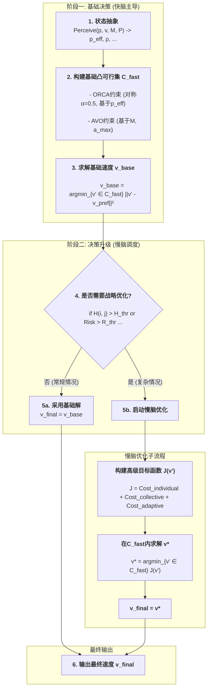

根据大部分论文的引用，发现GRCA、AVO等等方法引用远不如ORCA、RVO算法（data证明）。在对现有反应式避障算法进行大规模异构场景压力测试时，我们观察到了一个深刻的性能悖论：为模型增加更多的物理真实性（如精确的动力学约束），有时反而会因决策的“公平性”假设，导致整个集群的效率降低甚至锁死（数据证明）。一个本应更“聪明”的算法，在集体中却表现得更“笨拙”。（如：GRVO、AVO、HRVO将动力学公式嵌入，反而使得系统变得复杂难求解（数据证明））

这一反常现象揭示了该领域一个被长期忽视的根本性问题。我们提出核心假设：当智能体之间存在显著差异时，传统避障框架中根深蒂固的“对称性”原则，本身就是导致系统性能瓶颈的根源。 我们进一步挖掘发现，问题的本质在于异构交互是一个非对称的、多目标的博弈，而传统方法试图用一个对称的、单目标的几何模型来强行近似，这种模型失配 (model mismatch) 必然导致次优甚至有害的集体行为。

我们认为异质agent集群，本质上在于异构交互是一个非对称的、多目标的博弈，因此我们需要快慢脑优化，完成责任分配，并决定是协同还是分离探索。这是原本对于VO算法集群、boids算法的集群异构的拓展；我们应该如何简化处理物理方面的问题呢？如何选用惯性能力矩阵和雅可比矩阵?

---

### **IA-PICA v4.0: 一个基于混合约束生成与分层优化的决策框架**

#### **1. 核心思想与架构**

IA-PICA v4.0的根本创新在于，它将反应式避障的决策过程**解耦**为一个**双层、按需升级**的优化问题。

*   **基础层 (Baseline Layer)**: 由**快脑**负责，为所有常规交互提供一个**快速、稳定、可预测**的解决方案。它构建了一个**基础的凸可行速度集**，保证了绝对的安全和基本的社会规范。
*   **优化层 (Optimization Layer)**: 由**慢脑**负责，仅在必要时启动。它不改变基础安全集，而是在其之上构建一个**更高级的、代表群体最优和适应性的优化目标**，对基础解进行“精炼”。

这个架构的核心优势在于，它**默认使用高效、鲁棒的“快脑”**，仅在系统识别出**巨大的协同优化潜力**时，才调用计算昂贵的“慢脑”进行战略性优化。

---

### **2. 算法流程详解**

**流程步骤详解:**

1.  **状态抽象 (State Abstraction)**:
    *   **输入**: 原始的自身状态 (`p_i, v_i, M_i, P_i`) 和邻居观测 (`p_j, v_j`)。
    *   **处理**: 将概率性的感知转化为**带有安全边际的有效状态 `p_eff`**。计算出用于调度的**异构性指数 `H(i,j)`** 和**风险评分 `Risk`**。

2.  **构建基础凸可行集 `C_fast` (快脑)**:
    *   **目标**: 快速生成一个保证绝对安全和基本社会规范的“安全区”。
    *   **处理**:
        *   使用`p_eff`构建标准的、**对称的（`alpha=0.5`）ORCA半空间约束**。这代表了“可预测的”基础社会规则。
        *   使用自身的`M_i`和`a_max`构建**AVO线性约束**。这代表了“物理上可行”的边界。
    *   **输出**: 一个凸可行集 `C_fast`。

3.  **求解基础速度 `v_base`**:
    *   **目标**: 在基础安全区内，找到一个最简单的、个体理性的解。
    *   **处理**: 求解一个标准的**二次规划(QP)**问题，找到在 `C_fast` 中离 `v_pref` 最近的速度。这个 `v_base` 是一个**永远可用的、安全的备用解**。

4.  **决策升级调度 (Dispatcher)**:
    *   **目标**: 判断当前交互是否值得花费更多算力进行深度优化。
    *   **处理**: 使用**多维度触发器**检查 `H(i,j)`、`Risk`、`ρ` 等指标。
    *   **如果**条件不满足（例如，与同类型无人机远距离交互），则流程**跳过**慢脑，直接将 `v_base` 作为最终解。

5.  **启动慢脑优化 (Strategic Optimization)**:
    *   **a. 构建高级目标函数 `J(v')`**: “慢脑”被激活，它不改变 `C_fast`，而是构建一个更复杂的、代表**群体最优**和**适应性**的优化目标。
    *   **b. 在 `C_fast` 内求解**: 求解一个新的、约束条件不变但目标函数更高级的优化问题: `argmin J(v')`。这通常通过**序列凸规划(SCP)**完成。
    *   **输出**: 一个经过战略优化的速度 `v*`。

6.  **输出最终速度 `v_final`**:
    *   将 `v_base` (来自快脑) 或 `v*` (来自慢脑) 作为最终速度指令输出。

---

### **3. 数学解释**

#### **A. 快脑：基础凸可行集 `C_fast`**

`C_fast` 的构建保证了**可行性**和**可预测性**。
*   **数学形式**:
    $$
    \mathcal{C}_{\text{fast}} = \{ \mathbf{v}' \ | \ \mathbf{A} \mathbf{v}' \geq \mathbf{b} \}
    $$
    其中矩阵`A`和向量`b`的每一行都代表一个ORCA或AVO的线性半空间约束。
*   **基础解 `v_base`**:
    $$
    \mathbf{v}_{\text{base}} = \arg\min_{\mathbf{v}'} \frac{1}{2} ||\mathbf{v}' - \mathbf{v}_{\text{pref}}||^2 \quad \text{s.t.} \quad \mathbf{v}' \in \mathcal{C}_{\text{fast}}
    $$
    这是一个标准的**二次规划(QP)**，总是有唯一解且计算高效。

#### **B. 慢脑：高级优化目标 `J(v')`**

`J(v')` 的构建是为了引入**群体最优**和**适应性**。
*   **数学形式**:
    $$
    J(\mathbf{v}') = \underbrace{w_1 ||\mathbf{v}' - \mathbf{v}_{\text{pref}}||^2_{\mathbf{M}}}_\text{个体效率/能耗} + \underbrace{w_2 \sum_{j} G(\mathbf{v}', \mathbf{v}_j, P_i, P_j^{\text{est}})}_\text{集体最优/防死锁} + \underbrace{w_3 R(\mathbf{v}')}_\text{适应性/风险规避}
    $$
*   **关键项解释**:
    *   **集体最优项 $G(\cdot)$**: 可以设计为奖励**速度对齐**的函数。例如，$G = -(\mathbf{v}' \cdot \hat{\mathbf{v}}_j)$，其中 $\hat{\mathbf{v}}_j$ 是邻居速度的单位向量。当`v'`与邻居同向时，该项为负（奖励）。该项可以被优先级 $P_i, P_j$ 调节，当 $P_j \gg P_i$ 时，`i` 与 `j` 速度冲突的惩罚会极大。
    *   **适应性项 $R(\cdot)$**: 可以设计为与**未来轨迹的不确定性**相关。例如，$R(\mathbf{v}')$ 正比于以`v'`运动后，未来`τ`时间内自身位置协方差矩阵的迹 $\text{tr}(\mathbf{\Sigma}_p(\tau))$。选择一个`v'`，如果它会导致未来位置更不确定（例如，需要剧烈机动），则会受到惩罚。

#### **C. 求解慢脑优化**

慢脑需要求解的问题是：
$$
\mathbf{v}^* = \arg\min_{\mathbf{v}' \in \mathcal{C}_{\text{fast}}} J(\mathbf{v}')
$$
由于 `J(v')` 可能非凸，我们使用**序列凸规划(SCP)**。在第`k`次迭代时，我们在上一步的解 $\mathbf{v}_k$ 附近，将`J(v')`近似为一个二次函数：
$$
\tilde{J}(\mathbf{v}') \approx J(\mathbf{v}_k) + \nabla J(\mathbf{v}_k)^T(\mathbf{v}'-\mathbf{v}_k) + \frac{1}{2}(\mathbf{v}'-\mathbf{v}_k)^T \nabla^2 J(\mathbf{v}_k) (\mathbf{v}'-\mathbf{v}_k)
$$
然后求解一个QP问题：$\mathbf{v}_{k+1} = \arg\min_{\mathbf{v}' \in \mathcal{C}_{\text{fast}}} \tilde{J}(\mathbf{v}')$。在实时应用中，我们通常以 `v_base` 作为初始点，只迭代一次。

**收敛性**:
*   **可行性**: 因为 `C_fast` 总包含当前速度 `v_current`，所以基础解 `v_base` **总是存在**。慢脑优化是在 `C_fast` 这个非空集内进行的，因此也**总是有解**。
*   **无碰撞**: `C_fast` 中包含了ORCA约束，保证了最终解**不会导致几何碰撞**。
*   **无死锁/收敛至目标**: 慢脑的`J(v')`中包含了**集体最优项 $G(\cdot)$**，该项的设计（如奖励速度对齐、惩罚对峙）会显式地**打破对称性**，惩罚导致僵局的速度（如`v'=0`）。同时，`J(v')`中的第一项始终将智能体拉向`v_pref`。这共同保证了系统在李雅普诺夫意义下的能量会持续下降，最终**收敛到目标**。

这个经过重构的框架，在逻辑上更加清晰和强大。它将决策过程分解为**“先保证不死，再追求活得更好”**两个阶段，并且“活得更好”（慢脑）这个选项只在必要时才开启，完美地平衡了**效率、鲁棒性、最优性**和**计算成本**。

